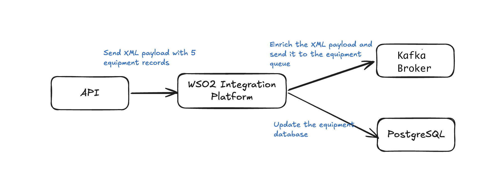

# DemoKafka

Ballerina integration service that exposes an HTTP API to receive equipment data in XML, persist it in PostgreSQL, and publish it to a Kafka topic with data enrichment.

## Architecture



```
HTTP Client
    │
    ▼ POST /api/equipment (XML)
┌─────────────────────┐
│  Ballerina Service  │
│  (port 8080)        │
│                     │
│  1. Parse XML       │
│  2. Insert DB       │──────► PostgreSQL (port 5432)
│  3. Enrich + Publish│──────► Kafka      (port 29092)
└─────────────────────┘
```

## Prerequisites

- [Ballerina](https://ballerina.io/downloads/) `2201.13.1`
- Docker + Docker Compose

## Local Setup

### 1. Start all services

```bash
docker compose up -d
```

| Service    | URL / Port                  |
|------------|-----------------------------|
| PostgreSQL | `localhost:5432`            |
| Kafka      | `localhost:29092`           |
| Kafka UI   | http://localhost:8090       |

### 2. Configuration

The `demokafka/Config.toml` file contains the default values:

```toml
dbHost     = "127.0.0.1"
dbPort     = 5432
dbName     = "postgres"
dbUser     = "postgres"
dbPassword = "root"

kafkaBootstrapServers = "localhost:29092"
kafkaTopic            = "equipment.topic"
```

### 3. Start the Service

```bash
cd demokafka
bal run
```

Wait for the `Ballerina HTTP listener started on port 8080` message before sending requests.

## Testing

### Curl — 1 equipment

```bash
curl -X POST http://localhost:8080/api/equipment \
  -H "Content-Type: application/xml" \
  -d '<equipmentList><equipment><equipmentName>CNC Machine</equipmentName><equipmentId>EQ001</equipmentId><manufacturer>ACME Corp</manufacturer><model>CNC-2000</model><serialNumber>SN123456</serialNumber></equipment></equipmentList>'
```

**Expected response**:
```json
{ "message": "Equipment added successfully", "inserted": 1 }
```

### Curl — 5 equipments

```bash
curl -X POST http://localhost:8080/api/equipment \
  -H "Content-Type: application/xml" \
  -d '<equipmentList><equipment><equipmentName>CNC Milling Machine</equipmentName><equipmentId>EQ001</equipmentId><manufacturer>ACME Manufacturing</manufacturer><model>CNC-2000X</model><serialNumber>SN-2024-001</serialNumber></equipment><equipment><equipmentName>Hydraulic Press</equipmentName><equipmentId>EQ002</equipmentId><manufacturer>TechPress Industries</manufacturer><model>HP-5000</model><serialNumber>SN-2024-002</serialNumber></equipment><equipment><equipmentName>Laser Cutting System</equipmentName><equipmentId>EQ003</equipmentId><manufacturer>LaserTech Solutions</manufacturer><model>LCS-3000</model><serialNumber>SN-2024-003</serialNumber></equipment><equipment><equipmentName>Robotic Welding Arm</equipmentName><equipmentId>EQ004</equipmentId><manufacturer>RoboWeld Corp</manufacturer><model>RWA-7500</model><serialNumber>SN-2024-004</serialNumber></equipment><equipment><equipmentName>Industrial 3D Printer</equipmentName><equipmentId>EQ005</equipmentId><manufacturer>PrintPro Systems</manufacturer><model>IP3D-9000</model><serialNumber>SN-2024-005</serialNumber></equipment></equipmentList>'
```

## Verification

### PostgreSQL

```bash
psql -h 127.0.0.1 -p 5432 -U postgres -d postgres -c "SELECT * FROM equipment;"
```

### Kafka UI

Browse messages visually at **http://localhost:8090** → Topics → `equipment.topic` → Messages

## Data Management

### Clear the table

```sql
DELETE FROM equipment;
```

## Data Enrichment (Kafka)

Before publishing to Kafka, each equipment item is enriched with computed metadata:

| Field | Description |
|---|---|
| `processedAt` | ISO 8601 timestamp |
| `priority` | `HIGH` (CNC/laser), `MEDIUM` (robot/3D), `NORMAL` (others) |
| `category` | `MACHINING`, `FORMING`, `CUTTING`, `ASSEMBLY`, `ADDITIVE_MANUFACTURING`, `GENERAL` |
| `source` | `EquipmentIntegrationService` |
